## 目录

1. [前言](#前言)
2. [一、软著基本常识 Q&A](#一软著基本常识-qa)
3. [Step 1. 准备一个“项目”](#step-1-准备一个项目)
4. [Step 2. 准备申请材料](#step-2-准备申请材料)
5. [Step 3. 官网在线申请流程](#step-3-官网在线申请流程)
6. [Step 4. 签章页与承诺表](#step-4-签章页与承诺表)

---

## 前言

网上很难找到个人完整申请软著的详细避坑教程，很多教程也过于久远。本文记录了近期 3 次成功下证的 0 成本、纯个人经验。

> ⚠️ **时效性说明**  
> 政策、系统页面和材料要求可能随时更新（例如近期关于“是否使用 AI”的承诺要求），正式提交前请以 [中国版权保护中心官网](https://www.ccopyright.com.cn/) 的最新信息为准。

> ⚠️ **关于补正**  
> 补正可能会遇到多种情况，主要原因为格式问题、文档重复或模版化问题。**软著没有很强的技术门槛，申请主要需要细心和耐心**。

---

## 一、软著基本常识 Q&A

软著全称“计算机软件著作权”，请认准唯一官网：[中国版权保护中心](https://www.ccopyright.com.cn/)。

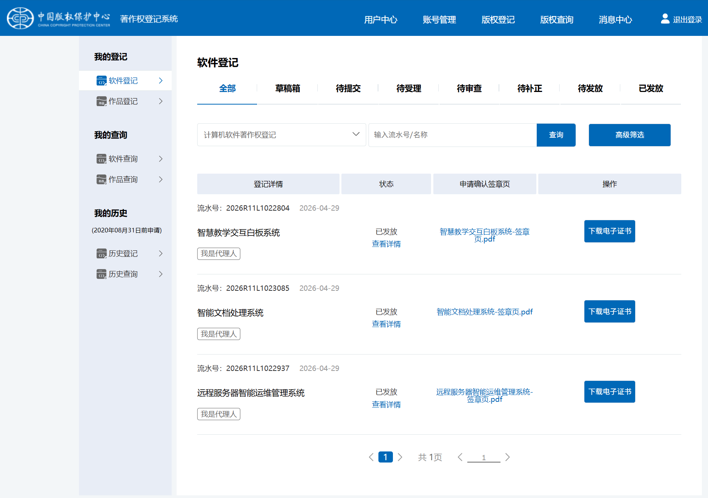

> **受众说明**：不想花钱找代做/代理机构的学生或打工人，且愿意自己动手整理材料。
>
> 社区已有相关的自动化生成材料项目：[SoftwareCopyright-Skill：自动生成软著申请材料](https://linux.do/t/topic/2082828)。

* **关于 AI 的使用？**  
  目前对 AIGC 内容审查较严。**建议代码可以借助 AI 编写，但“文档鉴别材料”（操作手册/设计说明）请务必手动编写**，避免因文档模版化被判 AIGC 要求补正。
* **软著要花钱吗？**  
  **个人自行申请完全免费（0 元）**。找代理机构收费属于第三方技术服务费。目前全流程已电子化，证书也是电子证书。
* **申请软著有什么用？**  
  主要用于学校评优加分、升学推免、单位评定或申请补贴等。
* **开源项目能申请吗？**  
  可以，申请时建议选择**未发表**。
* **对项目质量要求高吗？**  
  对内容本身几乎无严苛审核，系统只要有个 Demo 界面能截图写文档即可。

> 💡 **提示**：在一切开始之前，需在版权保护中心官网完成**注册和实名认证**（审核可能需要 1~3 天），建议提前认证。整体审核流程走完通常需要 1~3 个月（若算上学校/单位审批可能更久）。

---

## Step 1. 准备一个“项目”

1. **软件命名**：建议命名为 `xxxx软件` 或 `xxxx系统`，全局保持统一。
2. **代码量要求**：建议项目代码在 10,000 行以上（后面生成 60 页源代码材料，每页不少于 50 行）。
3. **Demo 界面**：无需完美无 Bug，但需要有基础界面用于截图制作《操作手册》。

> 💡 **项目灵感来源**：
> 1. GitHub 寻找轻量开源项目参考思路自行二次开发；
> 2. 解决日常生活中的小痛点，借助 AI（Vibe Coding）快速生成网页/工具；
> 3. 从课后大作业、例题延伸开发一个可视化工具。

---

## Step 2. 准备申请材料

整体申请主要包含以下材料：
1. **程序鉴别材料**：源代码整理为 PDF，总计 60 页。
2. **文档鉴别材料**：软件使用手册/设计说明书，图文结合展示功能。
3. **其他证明文件（可选）**：涉及合作开发或职务作品时提供。
4. **在线填报信息**：开发环境、功能描述等表单数据。

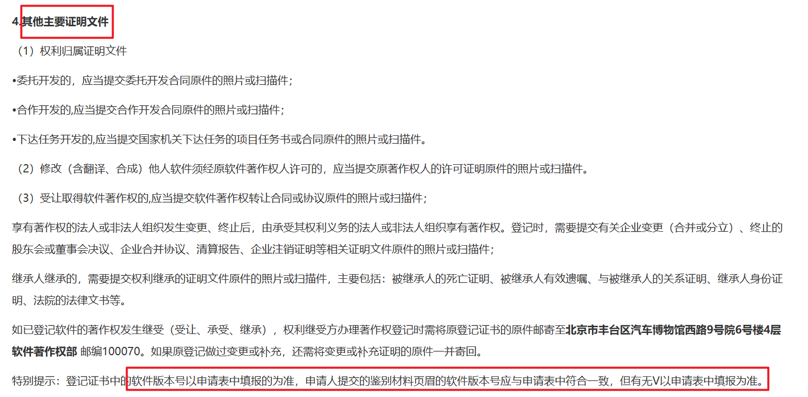

> 官方指南参考：  
> [软件著作权登记申请 - 所需文件](https://www.ccopyright.com.cn/index.php?optionid=1080) | [填表步骤说明](https://www.ccopyright.com.cn/index.php?optionid=1081)

---

### 1. 程序鉴别材料（源代码 60 页）

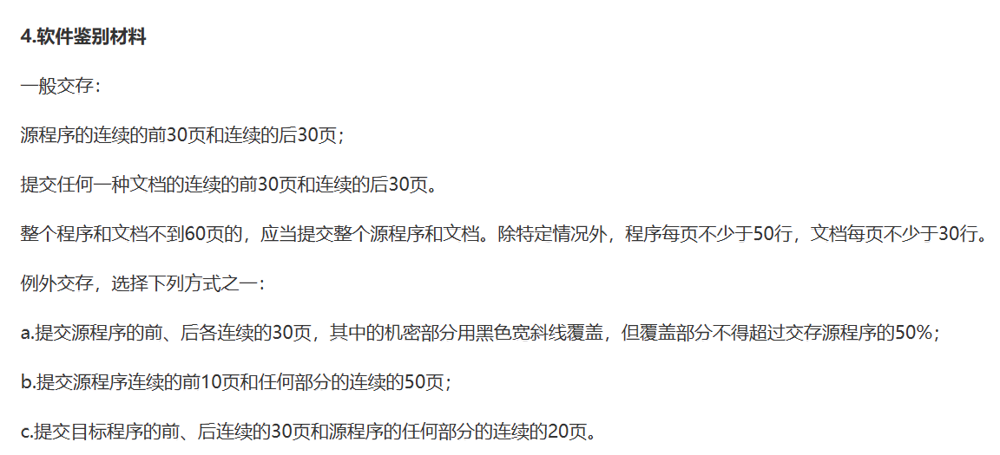

* **官方要求**：提交源程序连续的前 30 页和后 30 页（共 60 页），每页不少于 50 行代码；若整套代码不足 60 页，则全部提交。
* **推荐工具**：使用开源工具整理代码：[sc-codehandler：软著代码整理工具](https://github.com/SCDR/sc-codehandler)

**使用要点**：
1. 字体推荐使用 `Courier New`，英文字符等宽排版最工整；
2. 标题后缀填版本号（如 `V1.0`）；
3. 源码路径选择项目根目录，过滤掉 `node_modules`、打包产物、纯配置文件等；
4. 导出 Word 后删掉封面页（第一页直接为代码），确保最后正好 60 页，末页结尾处保持代码闭合（如带 `}`）；
5. 最终在 Word 中导出为 **文本型 PDF**。

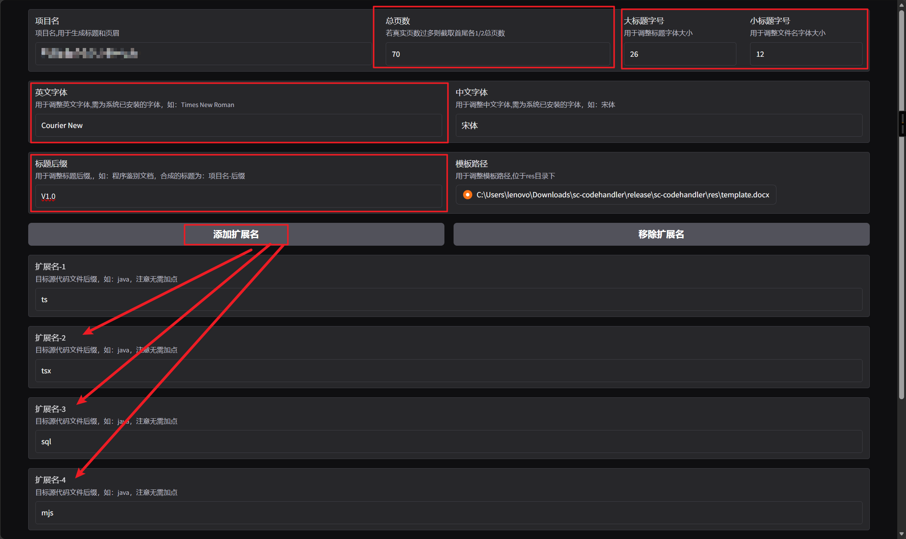
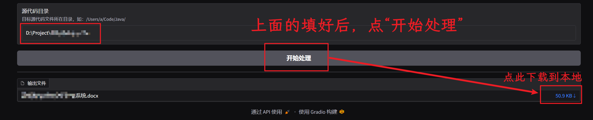

---

### 2. 文档鉴别材料（用户手册）

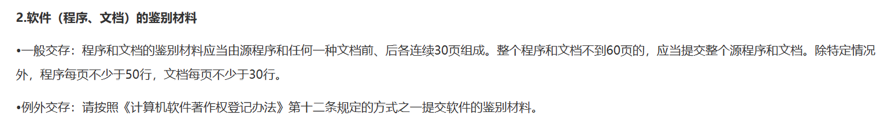

主要用于展示软件功能，需分模块截图并配以功能描述文字：

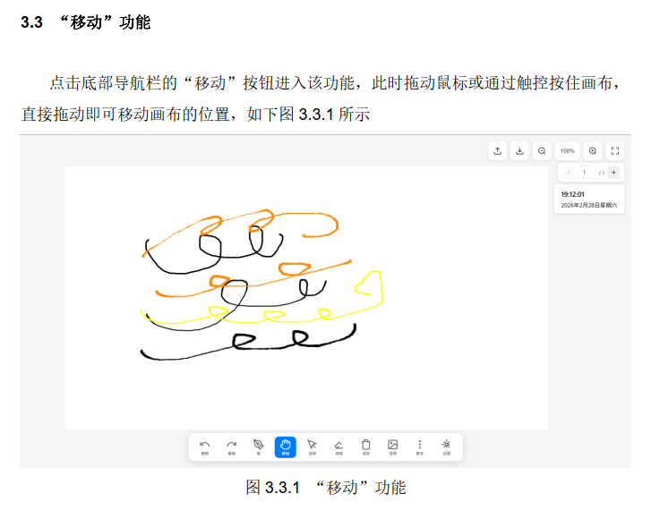

**自检清单**：
- [x] 最终提交格式为 PDF；
- [x] 截图清晰无打码（请使用测试数据，勿泄露真实域名/密钥）；
- [x] 截图中软件名称与版本号与申请表全局一致；
- [x] 图注编号、目录完整对应。

---

### 3. 官网填报参数模板参考

| 字段名称 | 填写字数限制 | 参考内容 |
| :--- | :--- | :--- |
| **开发的硬件环境** | 50 字符以内 | CPU：Intel Core i9；内存：16 GB；硬盘 512 GB |
| **运行的硬件环境** | 50 字符以内 | 服务端：内存 100MB+，空间 2GB+；客户端：内存 1GB+ |
| **开发操作系统** | 50 字符以内 | Windows 11 (64 位) |
| **开发工具** | 50 字符以内 | Visual Studio Code, Git |
| **运行平台/OS** | 50 字符以内 | 客户端：Windows / macOS / Linux；浏览器端 |
| **支撑环境** | 50 字符以内 | Chrome/Edge/Firefox 等现代主流浏览器 |
| **编程语言** | 多选/输入 | HTML, JavaScript, CSS, Python 等 |
| **源程序量** | 纯数字 | 如 12500 行 |
| **开发目的** | 50 字符以内 | 针对数字化教学互动场景开发，提供轻量化交互白板工具 |
| **面向行业** | 50 字符以内 | 教育信息化、智慧教育 |
| **软件技术特点** | 100 字符以内 | 基于 HTML5 Canvas 构建，支持多触点交互与离线本地部署 |

👉 <b>点击展开查看：软件主要功能描述参考（需 500~1300 字）</b>

本系统拒绝臃肿的界面设计，坚持以教师的真实授课逻辑为出发点，导航逻辑清晰，操作便捷简练，力求让每一位教育工作者都能实现“零学习成本”快速上手。在核心的书写与展示层面，本软件基于先进的 HTML5 高性能画布渲染引擎开发。该引擎能够精准捕捉并实时渲染用户的每一次输入，带来极其流畅、丝滑的无延迟书写体验。系统内置了多样化的笔触绘制选项（如硬笔、铅笔、毛笔等），并支持自由调节粗细与色彩。同时，丰富的几何图形插入功能使得教师在构建思维导图、绘制学科模型时更加得心应手，充分满足多样化的板书与批注需求。为了打破传统单向输出的沉闷课堂，系统深度内置了一系列极具巧思的互动教学工具。教师可以一键唤出计时管理，为随堂小测或小组讨论设定精准倒计时，有效掌控课堂节奏；随机点名功能则能瞬间提升学生的专注力与课堂悬念感；而分组积分看板更是游戏化教学的利器，教师可随时为不同小组动态加减分，极大激发学生的竞争意识与团队协作热情。此外，针对现代教室中广泛使用的触控教学大屏，本软件进行了底层的深度适配。不仅全面支持多点触控，还引入了“双指缩放”、“多点拖放”等原生手势操作，让教师在无垠的电子画布上自由漫游、聚焦细节。在辅助教学方面，系统巧妙整合了高度拟真的直尺、三角板、量角器等数学工具，让理科作图严谨且直观。

---

## Step 3. 官网在线申请流程

1. 登录 [中国版权保护中心](https://www.ccopyright.com.cn/)，进入业务办理页面选择 **`R11 计算机软件著作权登记`**。
   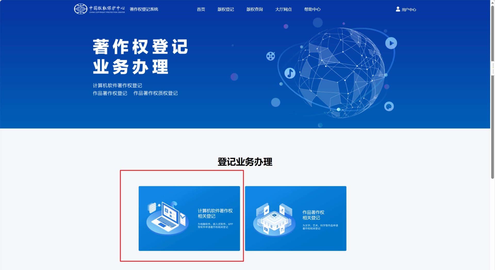
   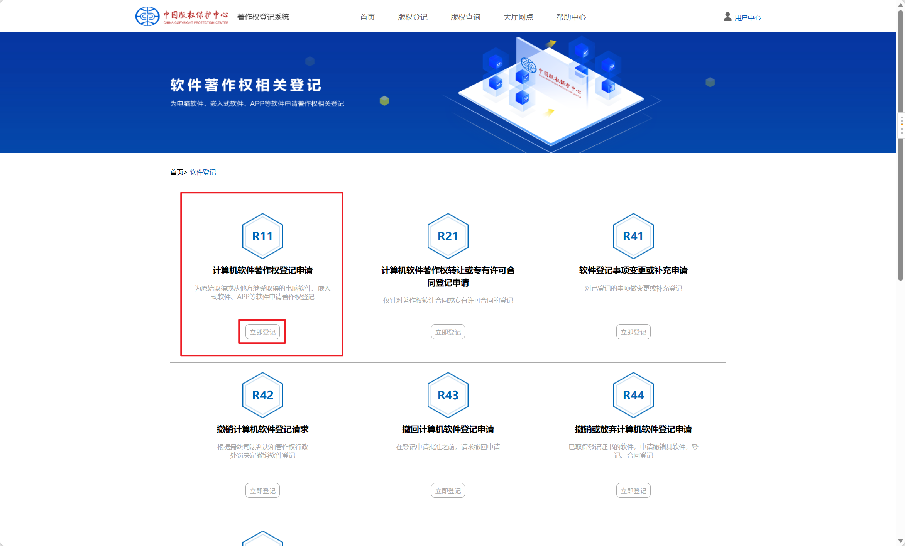

2. **选择申请人类型**：
   * **个人申请**：选择“我是申请人”；
   * **单位/学校代理**：选择“我是代理人”（需提前与单位管理人员沟通获取手机验证码）。

3. **填报软件信息与著作权人**：
   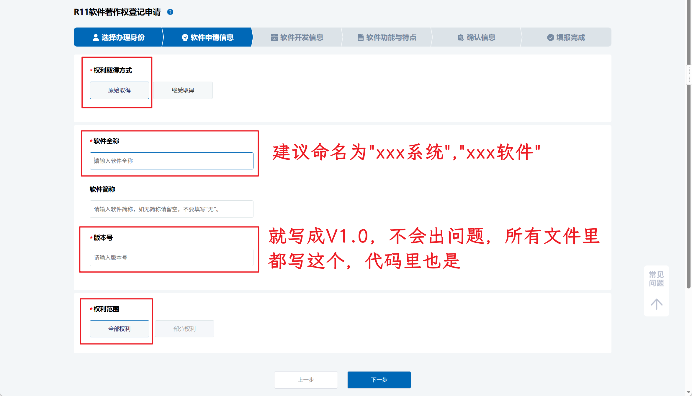
   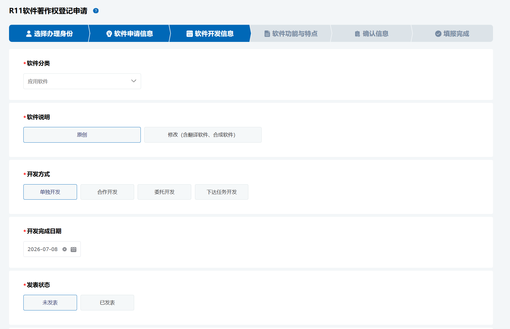
   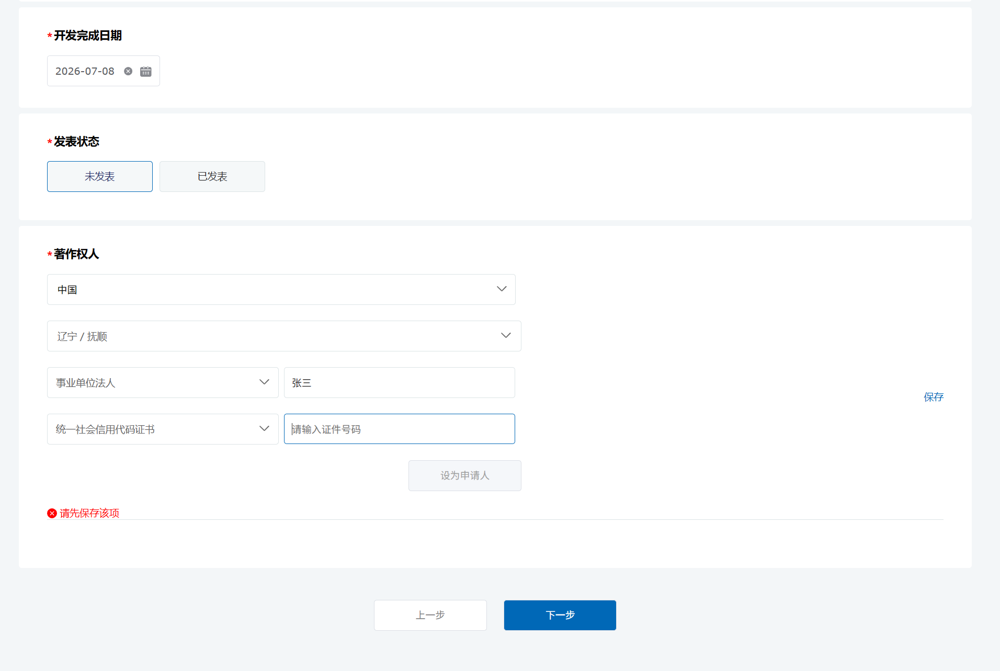
   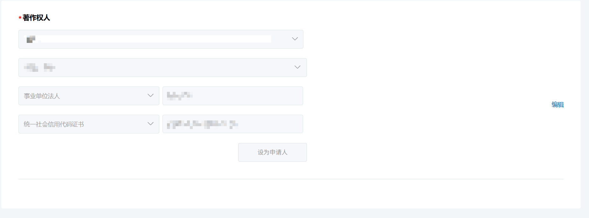

4. **上传材料**：
   * 依次上传生成的「源代码 PDF」与「文档手册 PDF」。
   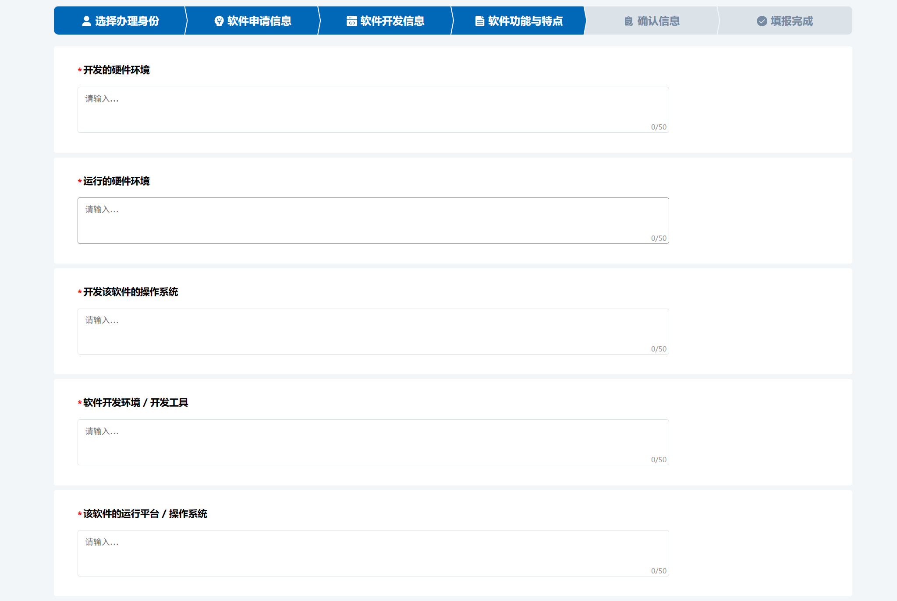
   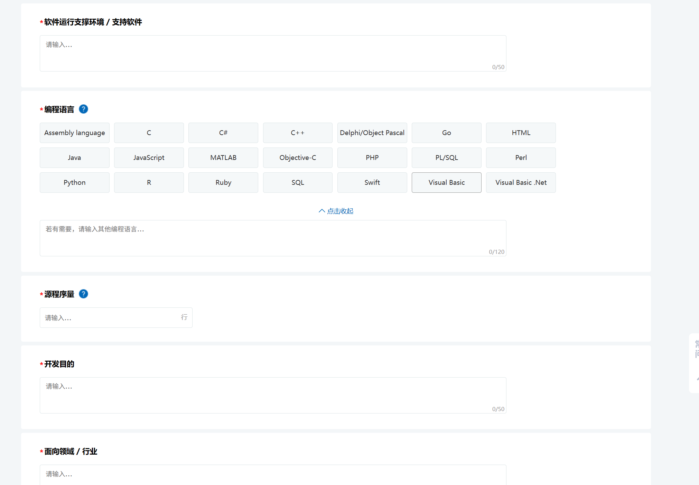
   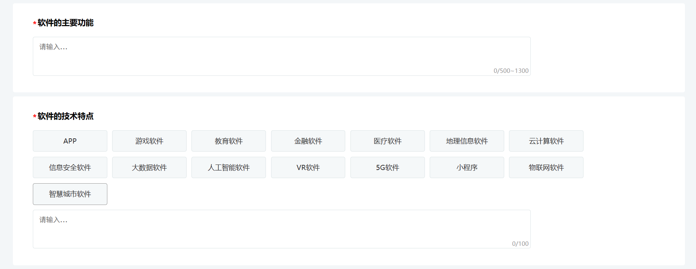
   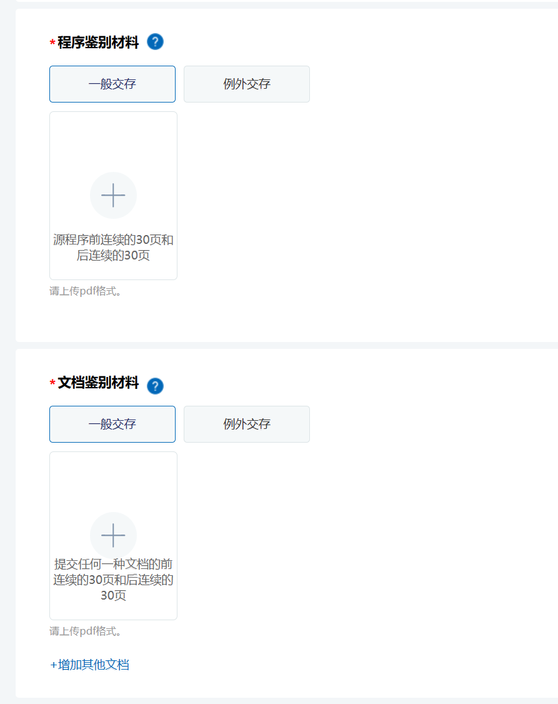
   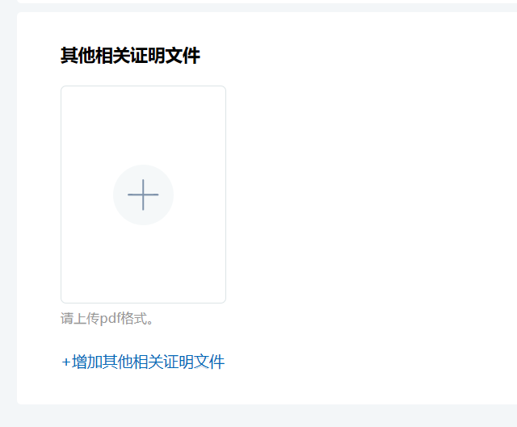

---

## Step 4. 签章页与承诺表

提交完成后系统会生成申请表，需下载打印并在右下角盖章/签字：

* **个人申请**：本人手写签字及身份证号。
* **单位申请**：加盖学校或企业公章。

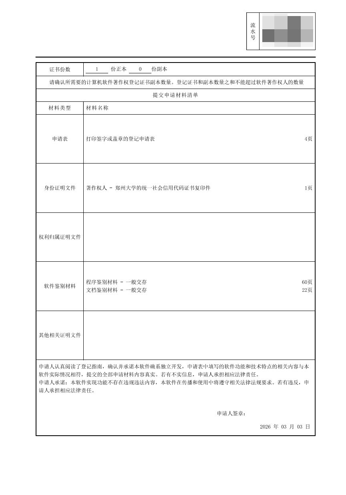
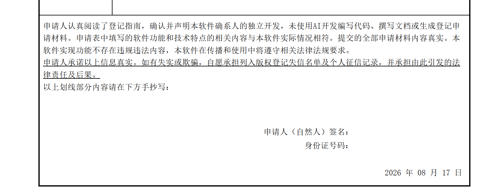

上传签章页扫描件后即完成整个申请流程。后续可在官网后台随时追踪审核进度。