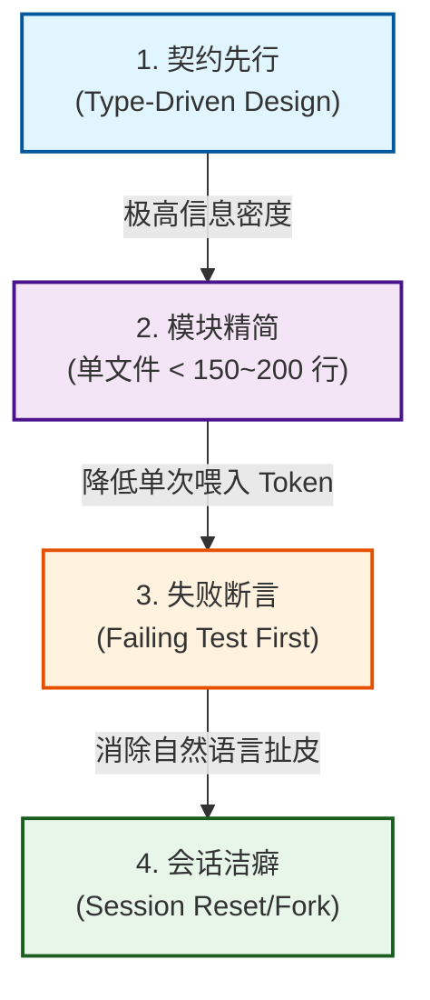
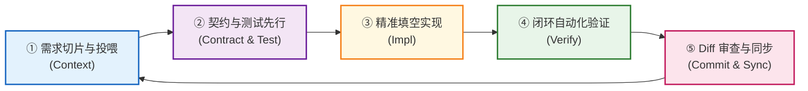

# 从"给 AI 打杂"到"十倍效能"：顶尖工程师的 AI 辅助研发与架构重构实战

> **摘要**：很多人用 AI 写代码是在"无脑 Tab"和"频繁修 Bug"之间反复横跳，而顶级工程师却能用极少的 Token、严谨的架构设计和自动化测试护栏，把 AI 的执行力压榨到极限。本文基于真实开源实战，系统复盘如何借助现代化 CLI Agent 工具、契约先行（Spec-First）与 AI 友好架构，将一个跨端桌面项目重构成高质量、可自愈的现代化工程。

---

## 目录
1. [认知重塑：真正的大佬究竟如何用 AI 做项目？](#一认知重塑真正的大佬究竟如何用-ai-做项目)
2. [武器进化：为什么终端 CLI/TUI 是 AI 编程的最佳载体？](#二武器进化为什么终端-clitui-是-ai-编程的最佳载体)
3. [核心方法论：如何用更少的 Token 做出更高质量的工程？](#三核心方法论如何用更少的-token-做出更高质量的工程)
4. [实战案例：VanishTrans 跨端项目"AI 友好型"四阶段重构](#四实战案例vanishtrans-跨端项目ai-友好型四阶段重构)
5. [未来可复用：AI 辅助开发五步闭环标准工作流（SOP）](#五未来可复用ai-辅助开发五步闭环标准工作流sop)

---

## 一、 认知重塑：真正的大佬究竟如何用 AI 做项目？

观察当前顶尖开源作者与架构师（如 Kent Beck, Simon Willison, Mitchell Hashimoto, Andrej Karpathy 等）的实践，顶级工程师从不让 AI"代替思考"，而是把 AI 当作**一个不知疲倦、执行力极高、熟读所有文档但缺乏大局观的初级工程师**。

他们的核心法则包括：

1. **契约先行与确定性约束（Spec & Test-Driven）**：先写严谨的接口类型（Interface/Schema）和断言测试用例，再让 AI 写实现代码直到测试绿灯通过。用编译器和单元测试充当"客观裁判"。
2. **极致的上下文工程（Context Engineering）**：将给 AI 的上下文视同 API 设计，剔除冗余噪音，保持低 Token 消耗与高信息密度（High Signal-to-Noise Ratio）。
3. **冷门与底层领域加速探索**：利用 AI 快速摸索复杂操作系统 API（如 POSIX PTY、Windows OCR）并输出最小可复现原型（MRE），再由人工进行抽象架构整合。
4. **红蓝对抗与架构推演（Red-Teaming）**：写出架构 RFC 后，让 AI 扮演资深专家挑刺，挖掘单点故障、竞争条件（Race Condition）与并发瓶颈。
5. **严苛的 Git Diff 掌控力**：对 AI 的产出保持高度审视，紧盯 `git diff`，防范内存泄漏、算法复杂度劣化以及异常静默吞没。

| 维度           | 普通开发者的用法                        | 顶级工程师的用法                              |
| :------------- | :-------------------------------------- | :-------------------------------------------- |
| **主导权**     | 让 AI 思考架构，自己打下手修 Bug        | 自己掌控架构与契约，AI 充当高效"施工队"       |
| **交互输入**   | 模糊的自然语言描述（"帮我写个xxx功能"） | 明确的契约（类型定义 + 失败的单元测试用例）   |
| **验证方式**   | 人肉运行看效果，凭感觉提交              | 自动化测试套件 + 编译器 + 逐行审查 `git diff` |
| **上下文控制** | 无脑喂全量代码，上下文迅速被废话污染    | 模块化隔离，精准投喂，善用分支与压缩          |

---

## 二、 武器进化：为什么终端 CLI/TUI 是 AI 编程的最佳载体？

与传统图形 IDE 中臃肿的弹窗和高延迟插件相比，以 **Pi Agent（`pi-coding-agent`）** 为代表的现代化 CLI 工具重新践行了 **Unix 哲学**（*Small core with programmable edges*）：

### 1. 终端原生与极低开销
* **精简 Prompt**：核心系统提示词控制在 1000 Tokens 以内，首字延迟极低。
* **管道与自动化组合**：天然支持 `cat error.log | pi "分析报错根因"` 或在 CI/CD 中以 headless 模式批处理执行。

### 2. 树状会话（Session Tree）与即时纠偏
* **树状分支回溯**：底层采用 JSONL 树结构存储，通过 `/tree` 或双击 `Esc` 随时回跳到任意历史节点开辟新分支，彻底解决长会话上下文跑偏问题。
* **实时转向（Steering）与排队**：
  * 按 `Enter` 发送 **Steering（转向指令）**，在 AI 工具执行间隙即时纠偏；
  * 按 `Alt+Enter` 发送 **Follow-up（后续排队指令）**，实现异步不间断协作。

### 3. 精准控制符号
* `@file`：模糊搜索并精准注入关键文件，不污染全局上下文。
* `!cmd`：执行命令并将输出结果作为上下文回传给 AI 分析（如 `!npm test`）。
* `!!cmd`：本地静默执行系统命令，零 Token 开销。

---

## 三、 核心方法论：如何用更少的 Token 做出更高质量的工程？

很多人在使用 AI 时的最大误区是**"只要出现问题，就打字长篇大论跟 AI 理论"**。这会导致会话历史迅速膨胀，AI 注意力涣散并产生严重的幻觉（Lost in the middle）。

要实现"低 Token、高质量"的开发闭环，需要践行以下 4 个工程准则：



1. **类型即最高密度的 Prompt**：100 Tokens 的严格类型接口（TypeScript Interface / Rust Struct），比 1000 字的模糊自然语言需求描述准确 10 倍。
2. **小文件与纯函数架构**：单文件超过 300 行会极大消耗上下文并增加改错概率。将业务拆解为纯函数和专用 Hook，AI 每次只需要看 1~2 个小文件。
3. **用报错断言代替口头描述**：给 AI 一个跑失败的单元测试，明确要求"*在不修改测试的前提下让测试全部变绿*"，一次命中答案。
4. **严格的会话洁癖**：每完成一个独立子任务，立刻开辟新会话或重置分支，只把最终代码作为上下文带入下一阶段。

---

## 四、 实战案例：VanishTrans 跨端项目"AI 友好型"四阶段重构

### 1. 项目背景与重构前痛点
**VanishTrans** 是一个基于 **Tauri 2 + React 18 + TypeScript + TailwindCSS + Rust** 的桌面 AI 翻译工具。重构前存在典型的跨端协作痛点：
* **IPC 字符串弱绑定**：前端组件中散落原生 `invoke('string_cmd', ...)`，后端修改极易引发前端运行时崩溃。
* **单体大组件耦合**：`TranslatePanel.tsx` 达 280+ 行，UI、拖拽、流式解析与网络请求混合，AI 修改极易引入回归 Bug。
* **缺乏自动化测试护栏**：每次修改必须手动打包并肉眼点按界面验证，耗时极长。

---

### 2. 四阶段重构实施路线

#### 阶段 1：建立全局上下文锚点（`AGENTS.md`）
* 在项目根目录下建立高密度规范文件 `AGENTS.md`，汇总 52 个 Tauri IPC 命令目录、分层架构职责与硬性编码红线。
* **收益**：AI Agent 启动即自动获取全局上下文，冷启动 0 废话。

#### 阶段 2：前后端 IPC 强类型桥接层重构（`tauriBridge.ts`）
* 创建 `src/services/tauriBridge.ts`，对全部 52 个 Tauri 命令进行强类型封装。
* 实现 `CommandError` 统一异常归一化与 Snake_case ↔ CamelCase 自动转换。
* **验证结果**：前端业务组件中 direct `invoke()` 调用清零，0 处 `any` 类型。

#### 阶段 3：前端核心功能解耦与轻量化（TranslatePanel 模块化）
* 将 280 行的单体面板拆解为 **9 个高内聚模块**：
  * **UI 纯组件**：`TranslatePanel.tsx` (102 行)、`FileDropZone.tsx` (90 行)、`InputSection.tsx` (135 行)、`OutputSection.tsx` (164 行)
  * **自定义 Hooks**：`useTranslation.ts`、`useFileTranslation.ts`、`useStreamHandlers.ts`
  * **纯工具函数**：`textUtils.ts` (7 个纯函数)、`fileParser.ts`
* **收益**：核心组件行数下降 64%，纯函数覆盖率从 10% 提升至 60%。

#### 阶段 4：建立轻量测试护栏（测试先行）
* **前端 Vitest**：覆盖文本分词、字符统计、SRT 字幕损坏容错、JSON 深层嵌套等 **156 个测试用例**。
* **后端 Rust**：在 `tm.rs` 与 `history.rs` 中利用内存 SQLite（`:memory:`）补充 **15+ 个测试用例**，覆盖 CSV 注入防护、BOM 处理与数据库迁移。

---

### 3. 重构成果数据对比
| 指标                 | 重构前       | 重构后                |
| :------------------- | :----------- | :-------------------- |
| **TranslatePanel 行数** | 280 行       | 102 行 ↓              |
| **核心模块总数**     | 2 个         | 9 个 ↑                |
| **纯函数比例**       | ~10%         | ~60% ↑                |
| **直接 invoke() 调用** | 分散各处     | 0 处 (解耦)           |
| **自动化测试用例数** | 0 / 极少     | 171+ (100%绿灯)       |
| **编译期类型检查**   | 弱绑定       | 严格 TS/Rust          |

---

## 五、 未来可复用：AI 辅助开发五步闭环标准工作流（SOP）

基于重构后的 AI 友好架构，后续任何新增功能或 Bug 修复均可严格按照以下 **SOP 循环** 进行：



### 步骤 1：需求切片与精准投喂（Context Slicing）
* **原则**：开全新会话，严禁全量投喂，仅使用 `@` 投喂最相关的 2~3 个文件。
* **Prompt 模板**：
  ```markdown
  我想为项目新增功能：[描述需求，例如：支持导出翻译历史为 Markdown]。
  请参考 @AGENTS.md 规范，先不要编写具体实现代码，请分析：
  1. 需要在后端新增哪些命令？
  2. 需要在 `src/services/tauriBridge.ts` 和 `src/types.ts` 暴露什么强类型接口？
  3. 前端需要修改/新增哪个子组件或 Hook？
  ```

### 步骤 2：契约与测试先行（Contract & Test First）
* **原则**：先定义结构体与接口签名，编写失败的测试用例作为约束。
* **Prompt 模板**：
  ```markdown
  请在 @src-tauri/src/[目标文件.rs] 中定义数据结构与函数签名，并使用 `#[cfg(test)]` 编写单元测试用例（覆盖正常流与异常边界）。
  同时在 @src/types.ts 与 @src/services/tauriBridge.ts 中补充对应的强类型请求/响应定义与函数包装。
  ```

### 步骤 3：精准填空实现（Implementation in Small Bites）
* **原则**：单次只实现 1 个文件，严格限制单文件行数在 150~200 行以内。
* **Prompt 模板**：
  ```markdown
  接口与测试已就绪，请实现 @src-tauri/src/[目标文件.rs] 的核心业务逻辑，使后端测试全部通过。
  【约束】保持函数纯粹、错误向上抛出为 Result<T, AppError>，禁止使用 unwrap()。
  ```

### 步骤 4：闭环自动化验证（Deterministic Verification）
* **原则**：运行一键检查脚本，将错误输出直接回喂给 AI。
* **执行命令**：
  ```bash
  npm run check && cd src-tauri && cargo test && cd ..
  ```
* **修复 Prompt 模板**：
  ```markdown
  运行测试时出现了以下报错：
  [粘贴终端报错日志]
  
  请在不修改测试用例预期的前提下，修复 @src/[出问题的文件] 中的逻辑缺陷。
  ```

### 步骤 5：Git Diff 审查与同步（Review & Sync）
* **原则**：严控最后一公里，运行 `git diff` 确认：
  * 零 `any`、零隐式类型逃逸；
  * 零未通过 `tauriBridge` 的非法调用；
  * 同步更新 `AGENTS.md` 中的命令目录；
  * 提交原子 Git Commit。

---

## 结语：从"工具使用者"到"架构驾驶员"

在 AI 大模型时代，编码的门槛正在迅速降低，但系统设计、模块抽象、边界防御与测试断言的价值却被无限放大。

通过打造高内聚、低耦合的 AI 友好型架构，建立严密的 自动化测试防盗栏，并配合高效的 终端 CLI 工作流，你将彻底摆脱被 AI 牵着鼻子走的被动局面，真正化身为拥有十倍生产力的"系统架构驾驶员"。

**本文项目案例地址**：[GitHub - Wang060919/VanishTrans](https://github.com/Wang060919/VanishTrans)
